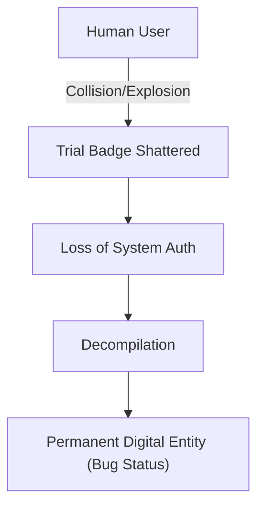

# MTPE Bible: Chapter 2 - Part 1: Falling Owl (落枭) v1.0

## Module A: Paragraph Analysis & logic

### [A.1] The Hero's Absence

**Source:** 这一觉我睡了很久... 发现我正躺在一间客房里，身边并没有人陪伴。
**Analysis:** Sakura wakes up in a bar (The The 'Drink' Bar). The absence of Owl highlights her vulnerability and transition from a rescued "damsel" to a protagonist forced to navigate the system alone.
**Tone Sync:** Maintain the "Mature" tone. The word "痴淫美梦" (erotic/obsessive dream) is translated as a "delirious, feverish dream" to reflect the intensity of her subconscious attraction to her savior without being trashy.
**Director's Cut:** "She wakes up in a room that smells like stale ale and ozone. Her knight is gone, leaving only the cold reality of her digital skin."

### [A.2] The Permanent De-compliation

**Source:** 我彻底变成了一团数据，被困在网络空间...
**Analysis:** The "Trial Badge" (体验勋章) destruction is the turning point. She is no longer a human user in a shell; she is indistinguishable from raw data.
**Terminology:** **Digitization** or **Decompilation**. In this context, "Digital De-compilation" sounds more technical and terminal.

---

## Module B: Vocabulary & Etymology

### 1. **Decompilation** /ˌdiːkəmpɪˈleɪʃən/

- **Part of Speech:** Noun
- **Etymology:** *De-* (reverse) + *compile* (gather/logic). To break down code into its constituent components.
- **Project Context:** The irreversible state where a human soul/data is assimilated by the Digital World's logic because their authentication hardware (Trial Badge) is destroyed.
- **Mermaid Logic:**

### 2. **Sovereignty** /ˈsɒvrənti/

- **Part of Speech:** Noun
- **Native Intuition:** Refers to supreme power or authority. In this project, used for "Tone Sovereignty" and "Terminology Sovereignty."
- **Example:** "He claimed sovereignty over the The 'Drink' Bar, ruling with a mix of charisma and cold logic."

---

## Module C: Translation Principles (Chapter 2 Focus)

- **Principle 1: Verb-Centricity.** Use aggressive verbs for combat and emotional reactions. (e.g., "The pressure pierced my skin" vs "The pressure made my skin hurt").
- **Principle 2: Dark Fantasy Polish.** Adam (HerculesKabuterimon) should sound like a cynical, world-weary expatriate. His French-accented English should be subtle but present in his word choice (e.g., calling himself an "Information Broker" with a touch of arrogance).

---

## Module D: Lore-Scan & Entity Mapping

### [Entity] Adam (亚当)

- **Form:** HerculesKabuterimon (力神比多兽).
- **Role:** Guild Master of "The 'Drink' Bar" (喝一杯酒吧).
- **Personality:** Cynical, French (Parisian), deeply integrated into the "Gray Areas" of Midgard.
- **Lore Note:** Hercules Beetle origin. His human form is an intellectual middle-aged man.

### [Entity] The 'Drink' Bar (喝一杯酒吧)

- **Category:** Guild / Hub.
- **Vibe:** Cyberpunk-Noir, frequented by Insect-type Digimon.
- **Rule:** A neutral territory where information is the primary currency.
