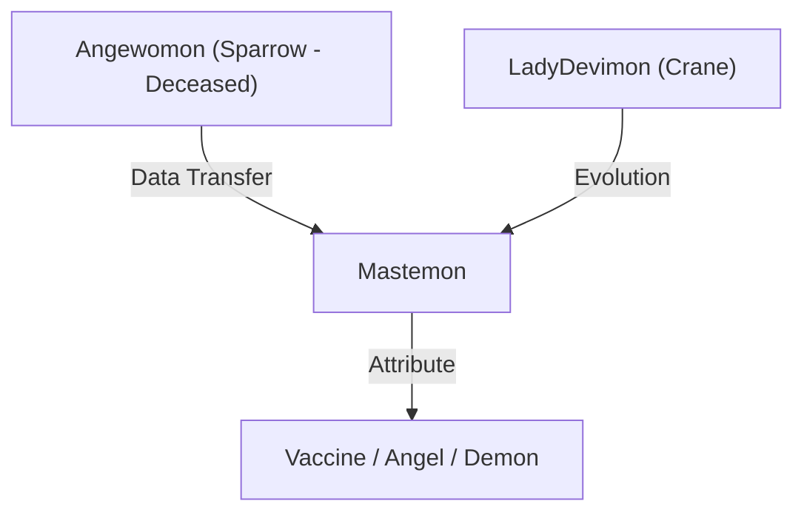

# MTPE Bible: Chapter 2 - Part 2: The Still Water (明镜止水) v1.0

## Module A: Paragraph Analysis & Logic

### [A.1] The Ghost of Sparrow

**Source:** 是一个叫雀（Sparrow）的天女兽... 让妖女兽的鹤进化成了莫斯提兽（MASTEMON）。
**Analysis:** Introduction of the backstory for Crane and the deceased Sparrow. Sparrow's death and the subsequent evolution into Mastemon (a Digimon born from the fusion of Light and Dark) is a central emotional anchor for the "Free Birds" group.
**Terminology Notes:** **Mastemon** (莫斯提兽) is the official localization. The fusion of **Angewomon** (Sparrow) and **LadyDevimon** (Crane) logic is preserved.

### [A.2] The Queen's Provocation

**Source:** “吃了老娘豆腐还想走，占便宜也不看看主人是谁！”
**Analysis:** Queen (TigerVespamon) represents the aggressive, self-governing nature of the The 'Drink' Bar. Her dialect and rough mannerisms are translated to reflect a "tough, street-smart leader" archetype.
**Tone Sync:** "Eating tofu" is a localized idiom for sexual harassment/groping. Translated as "Thinking you can cop a feel and just walk away? You clearly don't know whose turf you're on!" to maintain the gravity and mature tone.

---

## Module B: Vocabulary & Etymology

### 1. **Meticulous** /məˈtɪkjələs/

- **Part of Speech:** Adjective
- **Native Intuition:** Showing great attention to detail; very careful and precise.
- **Context:** Used to describe Owl's recording of the voice message for Sakura. "He was meticulous, ensuring every detail of her situation was explained."

### 2. **Mastemon** (Origin: *Mastema*)

- **Etymology:** Derived from **Mastema**, an angel who is the persecutor of evil in Hebrew folklore.
- **Symbolism:** Represents the union of opposites (Angelic and Demonic).
- **Mermaid Logic:**

---

## Module C: Translation Principles (Combat Focus)

- **Principle: Sound-to-Impact Mapping.** In the duel between Owl (BlackWarGreymon) and Queen (TigerVespamon), use onomatopoeia and sharp verbs to simulate the "clash of alloy."
- **Example:** "The Brave Shield slammed into her waist with a dull thud, the vibration rippling through the air."

---

## Module D: Lore-Scan & Entity Mapping

### [Entity] Falcon (隼)

- **Form:** CresGarurumon (偃月加鲁鲁兽).
- **Role:** Raiding Group "Free Birds" - Vanguard.
- **Personality:** Lively, impulsive, "younger brother" energy.

### [Entity] Queen (奎恩)

- **Form:** TigerVespamon (虎蜂兽).
- **Role:** Elite of The 'Drink' Bar. Known as the "Queen of Insects."
- **Ability:** **Royal Conquest** (光剑 - 秘密武器), **Mach Stinger V**.

### [Entity] Mastemon (莫斯提兽)

- **Lore Note:** A high-level Angel Digimon. In this story, it represents the legacy of Sparrow carried by Crane.
